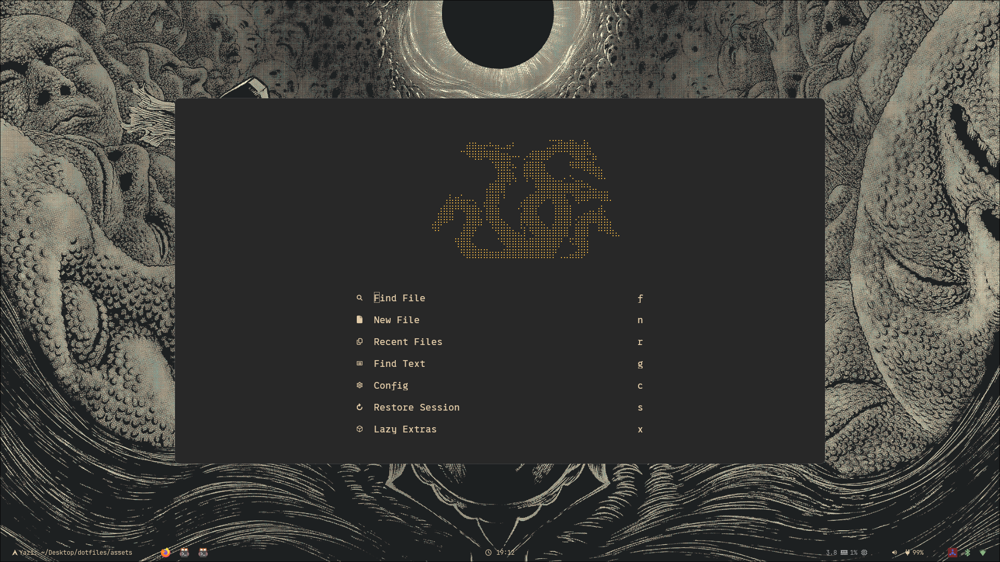
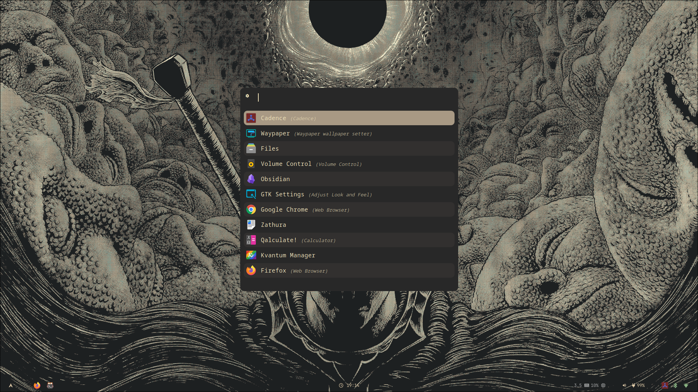
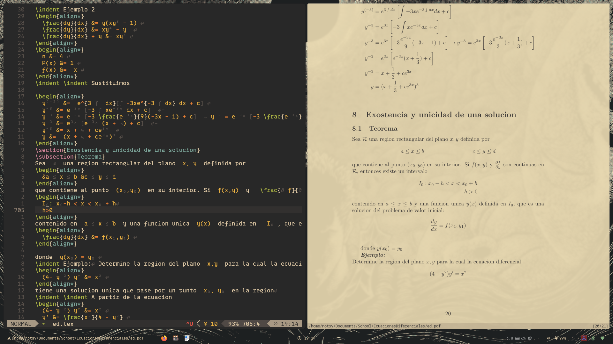
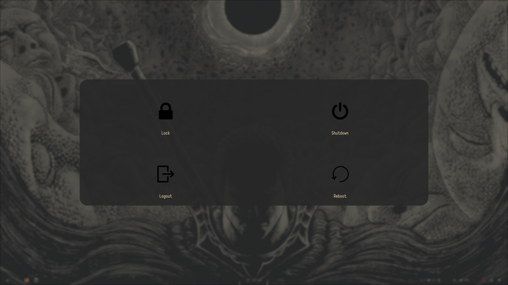
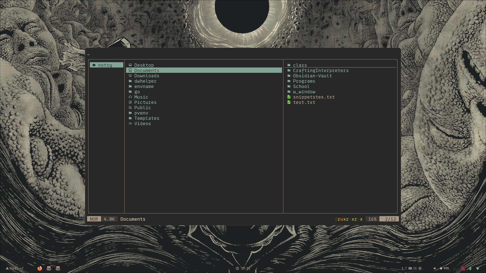

# ArchLinux dotfiles

## After minimal installation
First reboot after installation\
Needs, obviously, git and internet connection
## Usage
*Read the script files to understand what its done.\
Run the installation scripts, this will install all the packages, official and aur, and symlink the configuration files. As well as little more configuration needed.
## Showcase
### Neovim

### Rofi

### Zathura

### Wlogout

### Yazi

## Main packages
### Bluetooth
* blueman
* bluez
* bluez-utils
### Git
* git
* lazygit
* openssh
### Desktop
* hyprland
* hyprpaper
* hyprpicker (aur)
* hyprshot
* waybar
* waypaper(aur)
* hypridle
* wlogout
### Terminal
* kitty
* yazi
### Editors
* neovim
* nano
* zathura
* zathura-pdf-mupdf
* obsidian
### Daemons and applets
Both start after enabling the services
* NetworkManger
* Bletooth
Starts with the config
* dunst
Starts on call
* rofi-wayland(aur)
### Nerd fonts
* nerd-fonts
### Apps
* spotify-launcher
* firefox
* gimp
* obs-studio
* thunar
### Audio
* pipewire
* wireplumber
* pavucontrol
* pwvucontrol
* pamixer
* jq
### Extras
* unzip
* xdg-desktop-portal-hyprland
* xdg-user-dirs
* yay
* texlive
* trash-cli
* ripgrep
* fd
* polkit-kde-agent
* brightnessctl
* curl
### Programming
* luarocks
* wget
* rustup (official page)
* composer
* php
* npm
* nodejs
* openjdk
* julia
* ruby
* tree-sitter
* perl
* biber
* xdotool
* zoxide
TODO: missing needed packages
